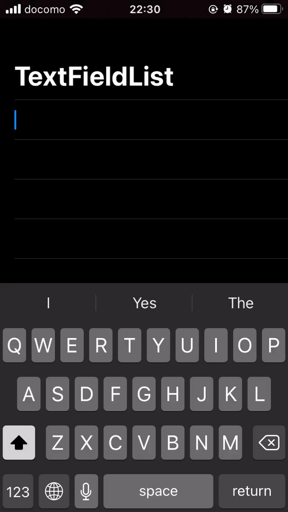

# CustomTextFieldList_SwiftUI
> List with TextField.

List with TextField. If you push Enter in TextField, the cursor will move to next TextField automatically.

# Application Image

  

## Release History

* 1.0.0
    * The first proper release
    * Just for example

## Meta

Tomoharu - [https://github.com/Toxumuharu](https://github.com/Toxumuharu)
